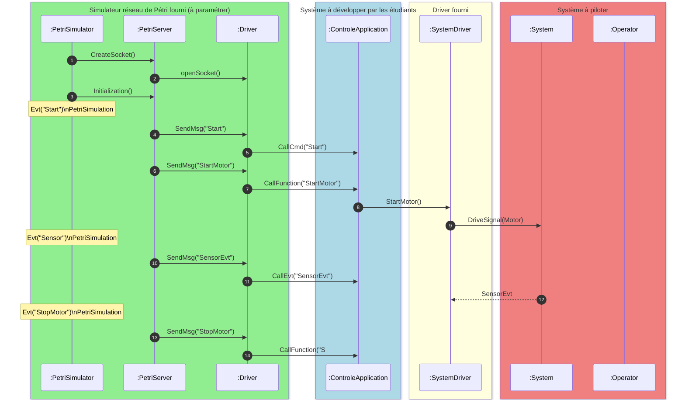
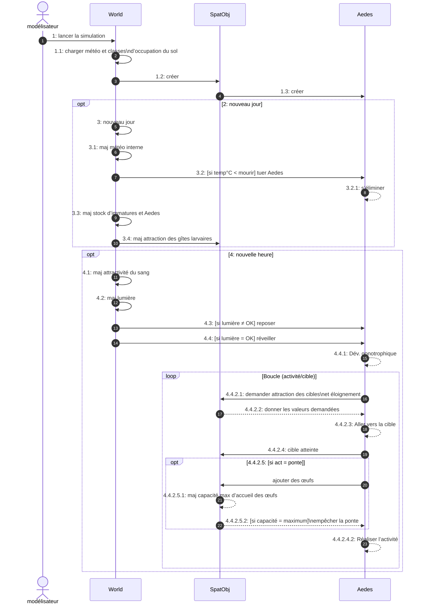

# Generated with IA

```mermaid
sequenceDiagram
autonumber

box lightgreen Simulateur réseau de Pétri fourni (à paramétrer)
participant PS as :PetriSimulator
participant PSe as :PetriServer
participant DR as :Driver
end

box lightblue Système à développer par les étudiants
participant CA as :ControleApplication
end

box lightyellow Driver fourni
participant SD as :SystemDriver
end

box lightcoral Système à piloter
participant SYS as :System
participant OP as :Operator
end

%% Phase d'initialisation
PS->>PSe: CreateSocket()
PSe->>DR: openSocket()
PS->>PSe: Initialization()

Note over PS: Evt("Start")\nPetriSimulation
PSe->>DR: SendMsg("Start")
DR->>CA: CallCmd("Start")

%% Démarrage moteur
PSe->>DR: SendMsg("StartMotor")
DR->>CA: CallFunction("StartMotor")
CA->>SD: StartMotor()
SD->>SYS: DriveSignal(Motor)

%% Remontée capteur
Note over PS: Evt("Sensor")\nPetriSimulation
PSe->>DR: SendMsg("SensorEvt")
DR->>CA: CallEvt("SensorEvt")
SYS-->>SD: SensorEvt

%% Arrêt moteur
Note over PS: Evt("StopMotor")\nPetriSimulation
PSe->>DR: SendMsg("StopMotor")
DR->>CA: CallFunction("S
```

# More complex

```mermaid
sequenceDiagram
autonumber

actor M as modélisateur
participant W as World
participant S as SpatObj
participant A as Aedes

%% 1) Lancement / création
M->>W: 1: lancer la simulation
W->>W: 1.1: charger météo et classes\nd’occupation du sol
W->>S: 1.2: créer
S->>A: 1.3: créer

%% 2–3) Nouveau jour
opt 2: nouveau jour
  W->>W: 3: nouveau jour
  W->>W: 3.1: maj météo interne
  W->>A: 3.2: [si temp°C < mourir] tuer Aedes
  A-->>A: 3.2.1: s’éliminer
  W->>W: 3.3: maj stock d’immatures et Aedes
  W->>S: 3.4: maj attraction des gîtes larvaires
end

%% 4) Nouvelle heure
opt 4: nouvelle heure
  W->>W: 4.1: maj attractivité du sang
  W->>W: 4.2: maj lumière
  W->>A: 4.3: [si lumière ≠ OK] reposer
  W->>A: 4.4: [si lumière = OK] réveiller
  A-->>A: 4.4.1: Dév. gonotrophique

  loop Boucle (activité/cible)
    A->>S: 4.4.2.1: demander attraction des cibles\net éloignement
    S-->>A: 4.4.2.2: donner les valeurs demandées
    A-->>A: 4.4.2.3: Aller vers la cible
    A->>S: 4.4.2.4: cible atteinte
    opt 4.4.2.5: [si act = ponte]
      A->>S: ajouter des œufs
      S-->>S: 4.4.2.5.1: maj capacité max d’accueil des œufs
      S-->>A: 4.4.2.5.2: [si capacité = maximum]\nempêcher la ponte
    end
    A-->>A: 4.4.2.4.2: Réaliser l’activité
  end
end
```