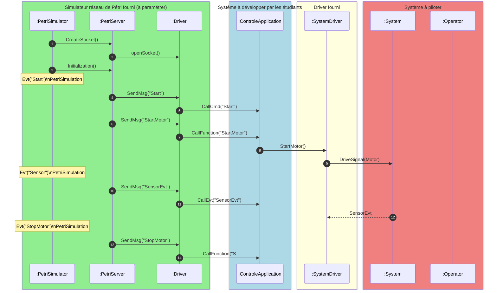

# Genrated with IA

```mermaid
sequenceDiagram
autonumber

box lightgreen Simulateur réseau de Pétri fourni (à paramétrer)
participant PS as :PetriSimulator
participant PSe as :PetriServer
participant DR as :Driver
end

box lightblue Système à développer par les étudiants
participant CA as :ControleApplication
end

box lightyellow Driver fourni
participant SD as :SystemDriver
end

box lightcoral Système à piloter
participant SYS as :System
participant OP as :Operator
end

%% Phase d'initialisation
PS->>PSe: CreateSocket()
PSe->>DR: openSocket()
PS->>PSe: Initialization()

Note over PS: Evt("Start")\nPetriSimulation
PSe->>DR: SendMsg("Start")
DR->>CA: CallCmd("Start")

%% Démarrage moteur
PSe->>DR: SendMsg("StartMotor")
DR->>CA: CallFunction("StartMotor")
CA->>SD: StartMotor()
SD->>SYS: DriveSignal(Motor)

%% Remontée capteur
Note over PS: Evt("Sensor")\nPetriSimulation
PSe->>DR: SendMsg("SensorEvt")
DR->>CA: CallEvt("SensorEvt")
SYS-->>SD: SensorEvt

%% Arrêt moteur
Note over PS: Evt("StopMotor")\nPetriSimulation
PSe->>DR: SendMsg("StopMotor")
DR->>CA: CallFunction("S
```